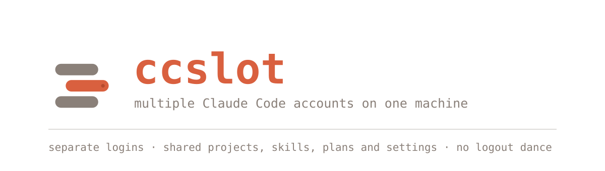
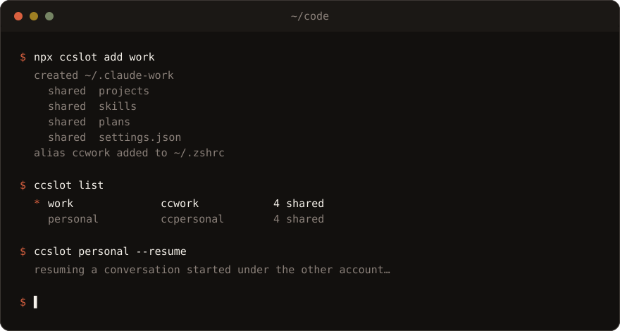

<p align="center">
  
</p>

<p align="center">
  <a href="https://www.npmjs.com/package/ccslot"></a>
  <a href="https://github.com/sumantadotai/ccslot/actions/workflows/ci.yml"></a>
  <a href="#license"></a>
  
  <a href="https://sumantadotai.github.io/ccslot/"></a>
</p>

Claude Code keeps everything in `~/.claude` — login, project history, skills, settings.
Two accounts means one seat that two people are fighting over, so switching means
`/logout` → `/login` → browser → approve → and your session is gone.

`ccslot` gives each account its own config dir via `CLAUDE_CONFIG_DIR`, then symlinks
`projects`, `skills`, `plans` and `settings.json` back to the original.
**Only the auth is separate.**

```bash
npx ccslot add work
ccslot work     # second account — same history, same skills
claude          # original account, still logged in
```

<p align="center">
  
</p>

Both can run at the same time, in two terminals. `/resume` works across them, because the
conversation history lives in the shared `projects/`. Hit your limit mid-task? Switch
accounts, resume, keep going.

## Install

```bash
npx ccslot add work      # no install needed
npm i -g ccslot          # or keep it around
```

Works on macOS, Linux and Windows. Node 22+.

`ccslot` manages Claude Code's config dirs — it does not ship Claude Code itself. If the
`claude` CLI is missing, every command that would launch it stops with instructions instead
of a confusing `ENOENT`:

```bash
ccslot install     # is it installed? if not, the exact commands, and offers to open the docs
```

```
  Claude Code is not installed (no `claude` on your PATH).
  ccslot only manages its config dirs — it needs the CLI itself.

  install Claude Code   curl -fsSL https://claude.ai/install.sh | bash
  or with npm           npm install -g @anthropic-ai/claude-code
  then log in           claude

  docs   https://code.claude.com/docs/en/overview
```

On Windows the first line is `irm https://claude.ai/install.ps1 | iex`.

## Commands

|                             |                                                                 |
| --------------------------- | --------------------------------------------------------------- |
| `ccslot add <name>`         | create `~/.claude-<name>`, link shared paths, add a shell alias |
| `ccslot list`               | list slots — `*` marks the one active in this shell             |
| `ccslot view <name>`        | what a slot shares and what is its own                          |
| `ccslot delete <name>`      | remove the slot dir and its alias (shared targets untouched)    |
| `ccslot <name> [args…]`     | launch Claude Code as that slot                                 |
| `ccslot run <name> [args…]` | same, explicit form                                             |
| `ccslot use <name>`         | switch the current shell (needs `eval`, see below)              |
| `ccslot install`            | check whether Claude Code is installed, and show how to get it  |

Options for `add` / `delete`:

```
--share a,b,c   override shared paths for this run
--prefix p      alias prefix (default cc, so "work" -> ccwork)
--rc <file>     shell rc file to write the alias into
--no-alias      skip writing the alias
--shell <name>  zsh | bash | fish | powershell | cmd  (for `use`)
-y, --yes       delete without confirming
```

## Three ways to run as a slot

```bash
ccslot work --resume          # launch directly — everything after the name goes to claude
ccwork --resume               # the alias `ccslot add` wrote to your rc file
eval "$(ccslot use work)"     # switch this whole shell, then run claude yourself
```

`ccslot work` is the everyday one. It spawns `claude` with `CLAUDE_CONFIG_DIR` set and
forwards the exit code, so it composes fine in scripts.

`use` needs the `eval` because a child process **cannot** change its parent shell's
environment — no CLI can. Run `ccslot use work` bare and it prints the exact line for
your shell. Fish, PowerShell and cmd get their own syntax.

## Config

Optional `~/.ccslotrc.json`:

```json
{
  "share": ["projects", "skills", "plans", "settings.json"],
  "aliasPrefix": "cc"
}
```

| Shared          | Why                                             |
| --------------- | ----------------------------------------------- |
| `projects`      | `/resume` works across accounts                 |
| `skills`        | write a skill once, every account has it        |
| `plans`         | plans made in one account readable from another |
| `settings.json` | one place for permissions, hooks, preferences   |

Everything else — `sessions`, `history.jsonl`, `.claude.json`, `plugins` — stays per slot.
Those are written by live sessions, so sharing them means two processes fighting over one file.

`ccslot` **refuses** to share `.credentials.json` even if you put it in `share`.
Sharing auth defeats the entire point.

## Bonus: a second identity for your MCP servers

This is the part people don't expect. OAuth-based MCP connections are stored **per config
dir**, exactly like your Claude login. So a slot isn't just a second Claude account — it's a
second set of credentials for everything Claude connects to.

If you have a work Jira and a personal (or client) Jira, the same MCP server can be
authorized as a different user in each slot:

```bash
ccslot add work        # authorize Atlassian MCP as you@company.com
ccslot add client      # authorize the SAME server as you@client.io
```

```
~/.claude-work    → Jira: you@company.com   Google Drive: work account
~/.claude-client  → Jira: you@client.io     Google Drive: personal
        ↑ different credentials              ↑ shared skills, shared history
```

Same MCP config, different identities, no re-authorizing when you switch. Useful for
contractors, anyone in two orgs, or keeping a personal Notion/Linear/Drive well away from
a company one.

The cost is the flip side of the same coin: **each new slot has to authorize its MCP
servers once.** That is the isolation doing its job, just pointed at something less
convenient than your login.

## Where the login actually lives

On macOS, Claude Code stores credentials in the Keychain with a separate entry per config
dir — not in the config folder at all. The accounts aren't taking turns with one auth file,
they're in genuinely different drawers.

On Linux (and anywhere the Keychain isn't available) it falls back to `.credentials.json`
inside the config dir. That's why it's on the never-share list.

`ccslot delete` leaves the Keychain entry behind. Remove it in Keychain Access if you care.

## Gotchas

- **Same repo, two accounts, at once.** They share `projects/`, so two live sessions in one
  repo are two processes writing near the same place. Nothing has corrupted in practice, but
  if you want it guaranteed safe, drop `projects` from `share` and lose cross-account `/resume`.
- **Windows without Developer Mode.** Symlinks need a privilege there, so `ccslot` falls back
  to junctions for directories and hard links for files. Same shared-storage behaviour;
  `ccslot view` tells you which kind you got.
- **Backup tools and symlinks.** If you sync `~/.claude`, check whether your tool follows
  symlinks — some back up the same data once per slot.
- **Use accounts you're entitled to.** Your own, or one your employer gave you. This isn't a
  way to farm accounts around limits.

## Doing it by hand

There's no magic here. `ccslot add two` is:

```bash
mkdir -p ~/.claude-two
ln -s ~/.claude/projects      ~/.claude-two/projects
ln -s ~/.claude/skills        ~/.claude-two/skills
ln -s ~/.claude/plans         ~/.claude-two/plans
ln -s ~/.claude/settings.json ~/.claude-two/settings.json
echo "alias cctwo='CLAUDE_CONFIG_DIR=\"\$HOME/.claude-two\" claude'" >> ~/.zshrc
```

The package exists so you don't get one path wrong at 11pm.

## Development

TypeScript, strict, compiled with `tsc` to `dist/`. No bundler, still zero runtime deps.

```bash
pnpm install        # installs the husky hooks too
pnpm build          # tsc -> dist/
pnpm test           # builds, then vitest
pnpm typecheck      # tsc --noEmit over src + test
pnpm test:coverage  # coverage/ — also posted to the CI job summary
pnpm docs:dev       # the docs site
```

```
src/
  cli.ts          the ccslot binary — arg parsing, output, spawning claude
  index.ts        public API, re-exports everything below
  slots.ts        add / list / view / remove / launchSpec / exportLine
  claude.ts       finding the claude CLI, install help, opening the docs
  links.ts        symlink, with the Windows junction + hard-link fallbacks
  shell.ts        shell detection, rc files, aliases, eval hints
  paths.ts        ~/.claude, ~/.claude-<name>, ~/.ccslotrc.json
  validate.ts     slot-name and shared-path rules
  constants.ts    DEFAULT_SHARE, NEVER_SHARE, RESERVED
  types.ts        shared types
test/             vitest — core.test.ts (unit), cli.test.ts (spawns dist/cli.js)
docs/             the docusaurus site
```

CI runs the suite on Linux, macOS and Windows across Node 22 and 24, plus coverage and a
commitlint check. Commits follow [Conventional Commits](https://www.conventionalcommits.org)
and husky enforces them locally. Releases go out through Changesets — add one with
`pnpm changeset` in your PR.

Bugs and PRs welcome: [CONTRIBUTING.md](CONTRIBUTING.md) ·
[file a bug](https://github.com/sumantadotai/ccslot/issues/new?template=bug_report.yml)

## License

MIT © Sumanta Kabiraj
